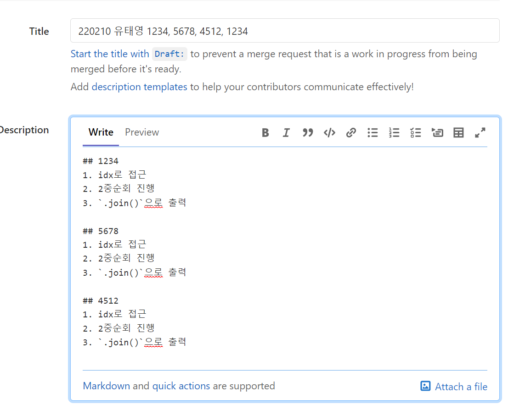

# 코드 제출 방법

```
$ git branch <브랜치이름>
$ git switch <브랜치이름>

$ git add .
$ git commit -m '문제번호, 문제제목'

$ git add .
$ git commit -m '문제번호, 문제제목'

$ git add .
$ git commit -m '문제번호, 문제제목'

...

$ git push origin <브랜치이름>
```


1. push 이후 `create merge request`



2. `Title`: 날짜, 이름, 문제번호(, 구분)

3. `Description`: 문제별 접근 방식 간략하게 기록

4. `Create Merge Request`

5. 추가 문제 풀이시

   ```
   # <브랜치명> 에서 그대로
   $ git add .
   $ git commit -m 'MSG'
   $ git push origin <브랜치명>
   ```


